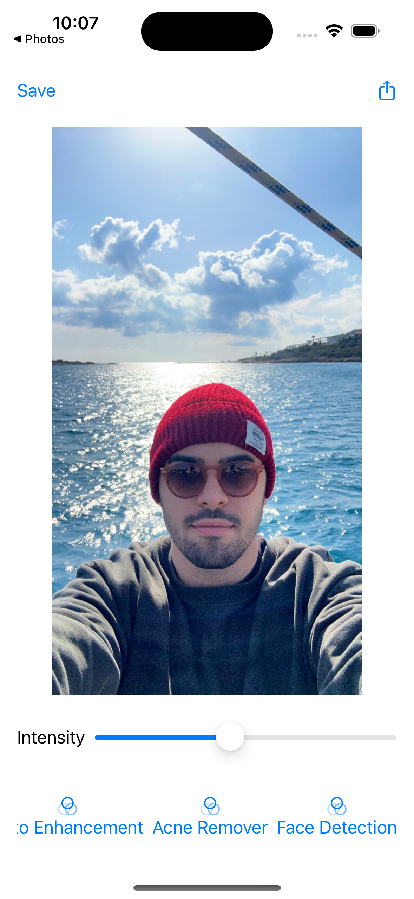

# PhotoEditor
Boiler plate implementation to apply filter on still images using Core Image Framework

Original Photo&nbsp;&nbsp;&emsp;&emsp;&emsp;&emsp;&emsp;&emsp;&emsp;&emsp;&emsp;&emsp;Gloom Filter                            
  

Auto Enhancement

 

Exposure

Sepia Tone

 

Sharpen

